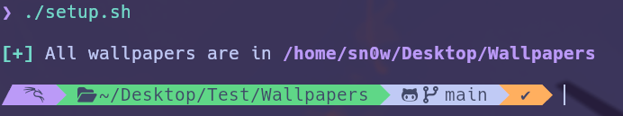
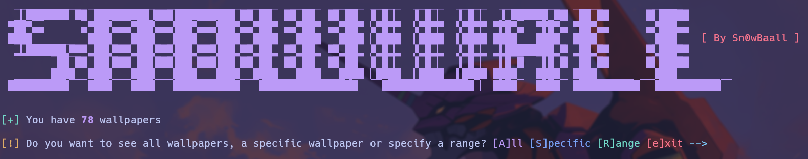
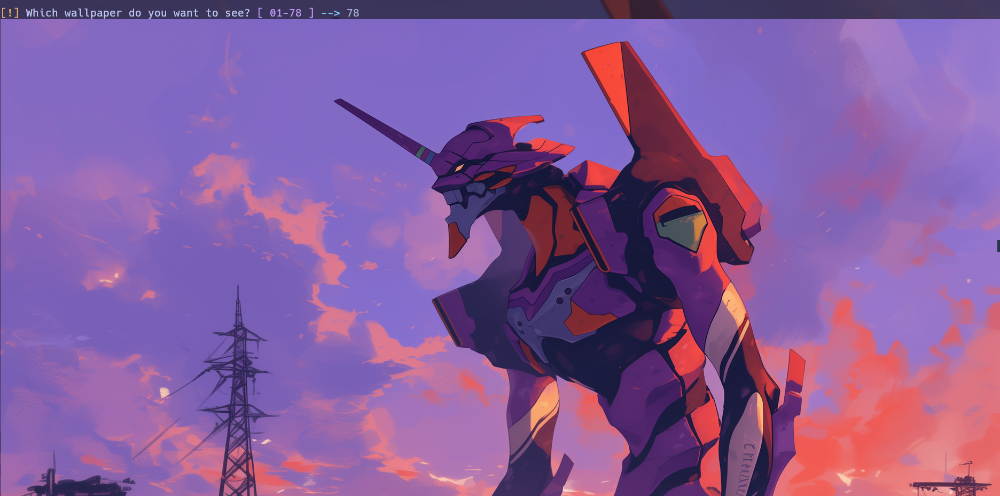

This repository takes wallpapers from [gh0stzk](https://github.com/gh0stzk/dotfiles), and other wallpapers from this page https://wallpapercave.com

After cloning the repository we will see that inside there are several files, among them there will be a script called **setup.sh** that will move the wallpapers folder to our desktop as shown in the image:

In the wallpapers directory located in **~/Desktop/Wallpapers** we are going to find a directory and a script, the "**WP**" directory is where the wallpapers are stored and the script **browser.sh** as its name indicates is a script that helps us to search the wallpapers as shown in the image:

This is the view of when the scrip shows you the image.

